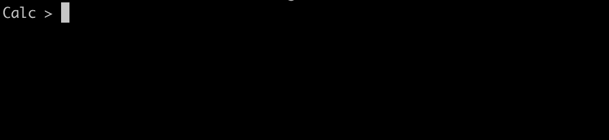

# MutableIn

MutableIn is a Go library that provides an os.Stdin-like stream for custom interactive input, enabling external modification and real-time reflection in the CLI.



## Table Of Contents
- [Installation](#installation)
- [Usage](#Usage)

## Installation
To install MutableIn, use the following command:
```bash
go get github.com/avearmin/mutable-in
```

## Usage
To incorporate MutableIn into your Go project, follow these steps:

1. Initialize MutableIn:
```Go
muIn := mutablein.NewMutableIn()
muIn.Init()
defer muIn.Close()
```
2. Pass MutableIn to a scanner:
```Go
scn := bufio.NewScanner(muIn)
```
That's it! Now, MutableIn will capture input from the keyboard like os.Stdin. The key distinction lies in the ability to write into it from your codebase:
```Go
muIn.Write([]byte("Hello world!"))
```
This input will seamlessly appear in your terminal, just as if it were typed from the keyboard. It can be added to with any key, and erased with backspace. This unique feature enhances the flexibility of interactive input handling in your CLI applications.
